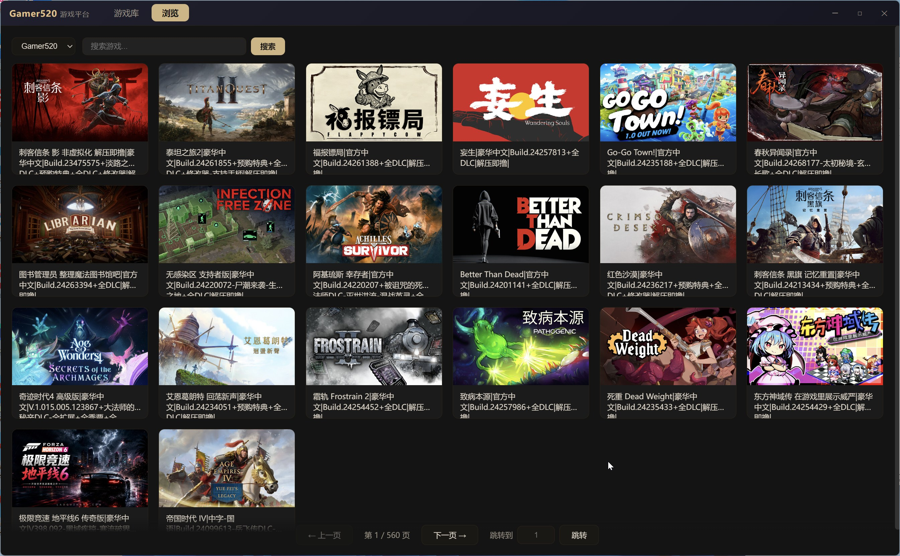
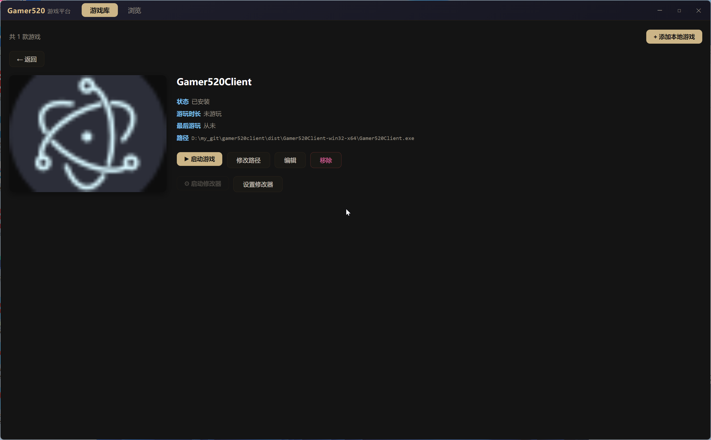

# Gamer520 客户端

一个用于浏览 PC 游戏资源、解析网盘下载信息、并像 Steam 一样管理本地游戏的桌面客户端（Electron，Windows）。

## 功能特性

### 多数据源浏览
聚合 Gamer520、ACG港湾 等站点的 PC 游戏资源，顶部可切换数据源，支持分页浏览与关键词搜索。



### 智能下载解析
自动解析游戏详情页中的网盘下载信息，兼容站点多种页面结构，一键复制：

- 支持百度网盘、夸克网盘、迅雷云盘、阿里云盘、123 云盘、天翼云盘、蓝奏云、OneDrive、Google Drive、MEGA、MediaFire、GOFILE 等
- 自动提取下载链接、提取码、解压密码，并生成二维码方便手机扫码保存
- 自适应多种页面结构：AJAX 镜像跳转、二维码卡片、隐藏字段、纯文本链接、直链文件列表、密码保护页面等



### 类 Steam 本地游戏库
- 将浏览到的游戏一键收藏进游戏库
- 添加本地游戏，自动提取 exe 图标作为封面
- 一键启动游戏，自动记录游玩时长与最后游玩时间
- 已安装 / 未安装状态标记

## 快速开始

### 绿色版（免安装，推荐）
下载 / 构建后进入 `Gamer520Client-win32-x64` 目录，双击 `Gamer520Client.exe` 即可运行。数据保存在 exe 同级的 `data\` 文件夹，随目录移动即可保留游戏库。

### 从源码运行
```powershell
npm install
npm start
```

### 构建绿色版
```powershell
npm run portable
# 产物：dist/Gamer520Client-win32-x64/
```

## 技术栈
- Electron + 原生 HTML/CSS/JS（深色黑金主题，无边框自绘标题栏）
- node-html-parser（页面解析）

## 免责声明
本项目仅用于学习与技术交流，所有游戏资源均来自第三方公开网站，本客户端不存储、不提供任何游戏本体文件。请支持正版游戏。

